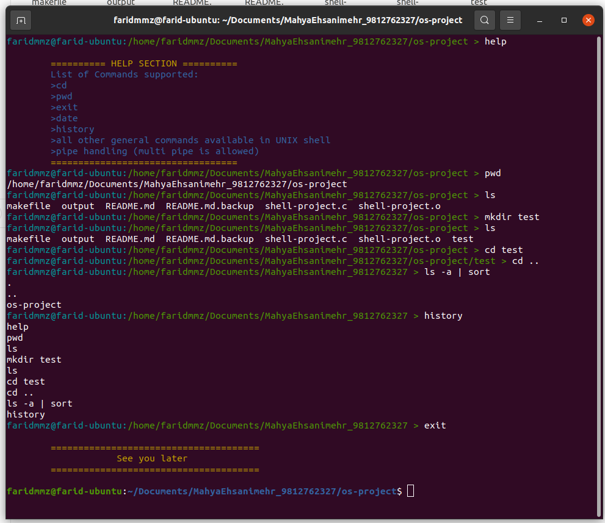

# Custom Linux Shell 
	
This is a simple shell program written in c language.
It can be executed on Linux based systems.

Created by [Mahya Ehsanimehr]
Operating Systems project


## Features
* Executing built in commands such as : `cd`, `pwd`, `exit`, `help`, `date`, `clear` and `history`
* Executing Linux commands such as : `ls`, `grep`, `echo` etc
* Handling muli-piped commands
* Doesn't exit with `ctrl+c`


## Usage
**compilation**
```$ make```

**execution**
```$ ./shell-project```

## Overview
The main part of the shell is a loop. Each time, shell takes the input from user.

After parsing the input and tokenizing it by spaces and \n, the input will be checked.
We've got 3 types of commands:
* built-in commands like cd and pwd
* Linux commands like grep
* piped commands

The program executes the commands based on the type of the command.

Now let's take a look at the functions of this program.

## Functions

* **main()** 

	In this function we have a loop which is the base part of the shell.
	the infinite loop will when stop user types `exit` or by pressing `ctrl+z`.

	*note!*  the shell won't stop with `ctrl+c`

* **sigintHandler()**

	This function catches the signal whenever we press `ctrl+c` and ignores it.
	
* **load_prompt()**

	Loading the prompt of shell which contains the user name and current directory.
	
* **get_input()**

	This function takes the input of user. We consider a char array called cmd which contains the input.
	
* **parse_command()**

	It receives the cmd array as input and tries to tokenize the input based on space and \n. 
	
* **command_type()**

	This functions checks the type of the command and returns an integer.
	
	If the command is :
	* null -> returns `0`
	* built-in -> return `1`
	* piped command -> returns `2`
	* Linux commands -> returns `3`

* **addToHistory()**

	Whenever user enters a command, the shell will save it in to an array called history and this will be done by `addToHistory` function. In this function, after adding the command to the array, we'll write it to another file called `history.txt` . This file contains all the commands of user.
	
* **exe_builtin_command()**	

	In this function, the command will be compared to built-in commands.
	If it's a built-in command, then the program executes it.
	* **exit:** Implemented with a simple `exit(0)`
	
	* **history:** Iterating over the history array and printing the result
	
	* **cd:** If user enters `$ cd` we'll just use `getenv()` to print the home directory.
	Otherwise, we just use the `chdir()` function.
	
	* **pwd:** Printing the current directory using `getcwd()`
	
	* **help:** Showing simple info about shell
	
	* **clear:** Implemented by `system("clear")`
	
	* **date:** shows the current time and date
	
* **exe_command()**

	For executing a Linux command we can use `fork()` to create a child process. This new process has an id equal to 0. So this child process will execute the command we've typed. Meanwhile, parent process should wait for its child to finish and this will be done by `wait(NULL)`.
	
* **exe_pipe_command()**
	
	Executing piped commands will be done by this function. There's a loop in this function for executing each command. the inner loop of this loop is for separating commands between pipes. Then each command will be sent to `pipe_process()` function to be executed.
	Whenever we try to execute a piped command, we have to use file destinations. Because the whole thing of piping is about reading from a file and writing to another.
	Assume that cmd1 and cmd2 are piped like below:
	
	```$ cmd1 | cmd2```

	The output of cmd1 will be the input of cmd2 so that's why we should use file destinations.
	Since the shell supports multi piped commands, we have to consider 2 file destinations. One when we're executing an odd command(the index is odd) and one when it's even.
	Then we `fork()` to create child process. The process has to use `dup2()` to write to a file destination.

## Result
Here are some commands in my custom shell:


## Contact
Created by [mahya.ehsanimehr@gmail.com](mailto:mahya.ehsanimehr@gmail.com) - feel free to contact me!